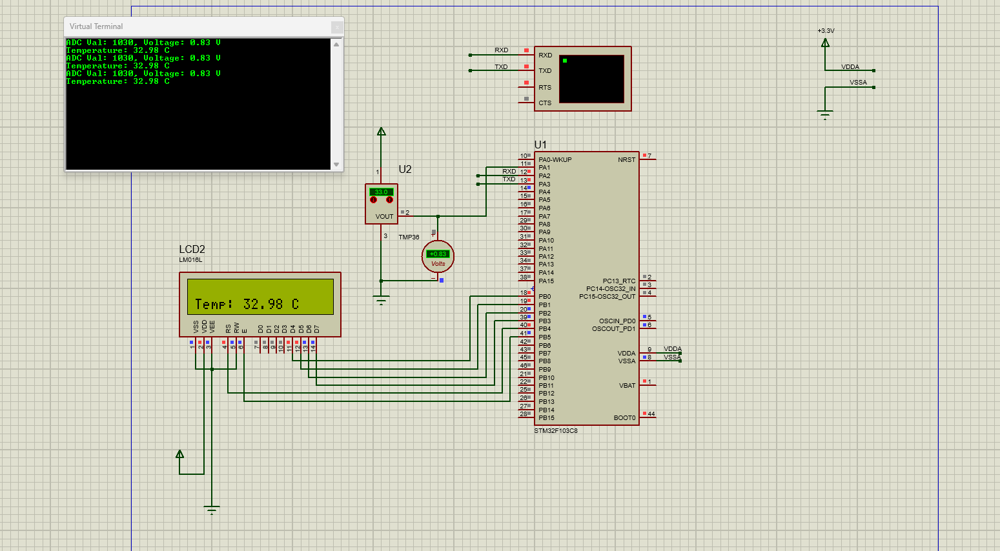

# 🌡️ STM32 TMP36 Temperature Monitor

This project demonstrates how to interface the **TMP36 analog temperature sensor** with an **STM32F103C8** microcontroller to monitor ambient temperature. The temperature data is displayed on a **16x2 LCD** and also sent via **UART** to a serial terminal.

## 🔧 Features

- Reads analog temperature values using ADC.
- Converts ADC value to voltage and then to temperature (°C).
- Displays temperature on:
  - 16x2 LCD screen.
  - Serial terminal (via UART at 9600 baud).
- Includes debug info: ADC value and voltage.

---

## 🧰 Hardware Requirements

| Component        | Description                    |
|------------------|--------------------------------|
| STM32F103C8T6    | Main microcontroller (Blue Pill) |
| TMP36            | Analog temperature sensor      |
| 16x2 LCD         | For displaying temperature     |
| UART to USB TTL  | For serial communication       |
| Breadboard & Wires | Standard prototyping hardware |

---

## 🔌 Pin Connections

### LCD (16x2 - 4-bit mode)

| LCD Pin | STM32 Pin | Port |
|---------|-----------|------|
| D4-D7   | PB0-PB3    | GPIOB |
| RS      | PB4        | GPIOB |
| EN      | PB5        | GPIOB |

### TMP36 Sensor

| TMP36 Pin | Connection |
|-----------|------------|
| VOUT      | PA1 (ADC1 Channel 1) |
| GND       | GND        |
| VCC       | 3.3V       |

### UART (Serial Terminal)

| UART Pin | STM32 Pin |
|----------|-----------|
| TX       | PA2       |
| RX       | PA3       |

---

## 🛠️ How It Works

1. **ADC Initialization**: The STM32 ADC1 reads analog voltage from the TMP36.
2. **Voltage Calculation**: Converts ADC value to voltage using:  
   \[
   \text{Voltage} = \frac{\text{ADC} \times 3.3}{4096}
   \]
3. **Temperature Conversion**: TMP36 outputs 750 mV at 25°C with 10 mV/°C scale.  
   \[
   \text{Temperature (°C)} = (\text{Voltage} - 0.5) \times 100
   \]
4. **Display**: Temperature is shown on the LCD and sent via UART.

---

## 📷 Simulation



---

## 🧪 Sample UART Output

```
ADC Val: 1030, Voltage: 0.83 V
Temperature: 32.98 C
```

---

## 📁 File Structure

- `main.c` - Application logic  
- `lcd.h`, `lcd.c` - LCD driver functions  
- `send.png` - Schematic and simulation view

---

## 🚀 Getting Started

1. Open the project in STM32CubeIDE or Keil uVision.
2. Flash to your STM32 board.
3. Connect TMP36 and LCD as described.
4. Open a serial monitor (e.g., PuTTY, Tera Term) at **9600 baud**.

---

## ⚠️ Notes

- Ensure ADC reference voltage is 3.3V.
- TMP36 requires stable voltage supply for accurate readings.
- Adjust `ADC_CHANNEL_1` in `MX_ADC1_Init` if you connect the sensor to another pin.
